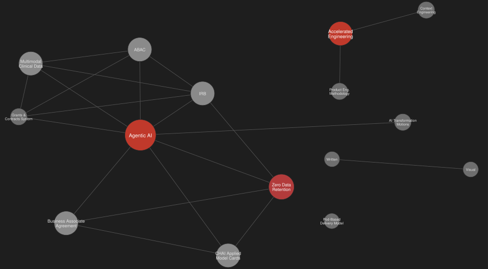

<!-- _class: lead -->

# Rabbit Wiki: how this repo remembers what it learns

WHAT · WHY · HOW · OUTCOME, plus how the pattern grows up

---

# WHAT — a Karpathy-pattern LLM wiki

- `meta/rabbit-wiki/` — a durable, structured markdown wiki: 10 pages, 16 linked concepts, immutable source archive
- Karpathy pattern: the LLM **compounds** knowledge into pages, instead of re-deriving synthesis from raw documents every query
- Five skills run the lifecycle: `rabbit-ingest` → `rabbit-analyze` → `rabbit-query` / `rabbit-lint` / `rabbit-session-close`

---

# WHY — durable knowledge beats scattered docs

- Meeting notes, chat history, and one-off docs decay and get lost between sessions
- A wiki page is a **standing, queryable fact**, not a transcript to re-read
- `rabbit-query` always answers with a citation to a specific wiki entry, or states plainly that no entry answers the question — no guessing
- `rabbit-lint` checks the wiki's own health: contradictions, stale pages, orphan pages, missing cross-references

---

# HOW — ingest, analyze, query, lint

- Linear pipeline, one shared wiki, one ontology file
- `rabbit-session-close` is the only step that folds a session's draft material back in, and only when explicitly asked

---

# OUTCOME — where this repo's wiki stands today

- 10 wiki pages, 16 linked concepts, and growing with every ingest/analyze cycle
- Not yet built: contradiction/staleness log, judge-style review, per-feature wiki isolation
- Small so far, but a good proof of concept

---

# Pursuit Forge — the same pattern, grown up

- A separate, more mature project running the identical pattern, at real scale
- 250+ append-only log entries; one page alone revised 8 times over 6 weeks as evidence trickled in
- What's new here: judge-agent review before merge, plus a full audit trail

---

# Concept graph — Pursuit Forge's ontology, cross-linked

- 15 concepts, 21 real `[[wikilink]]` cross-references
- Dense cluster on **Agentic AI** / **Zero Data Retention**; **Pod-Based Delivery Model** has no links yet — a real gap

---

# What this repo could grow into

| | This repo | Pursuit Forge |
|---|---|---|
| Wiki scope | one shared wiki | per-client + shared roots |
| Review step | none | judge-agent deliberation |
| Audit trail | none | append-only `log.md` |
| Health check | `rabbit-lint` | linting + deliberation history |

**Next step:** add a `log.md` audit trail so every ingest/analyze/lint pass is traceable.
