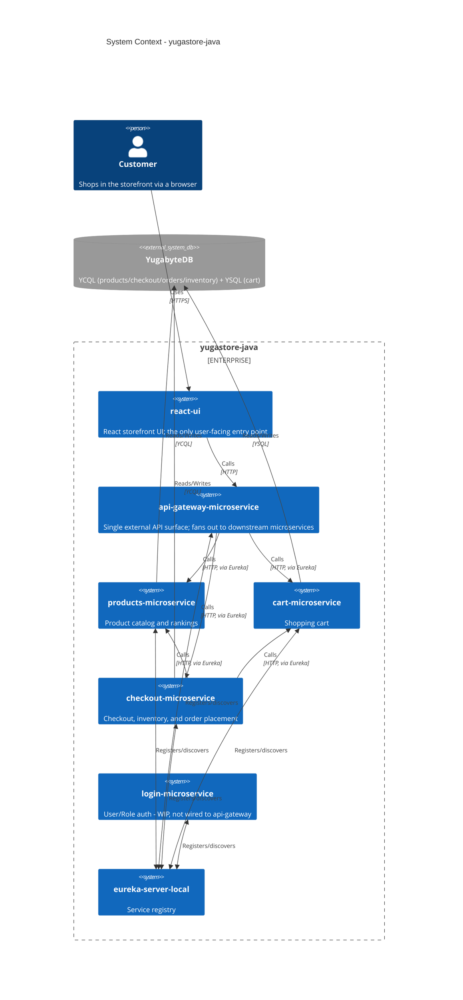
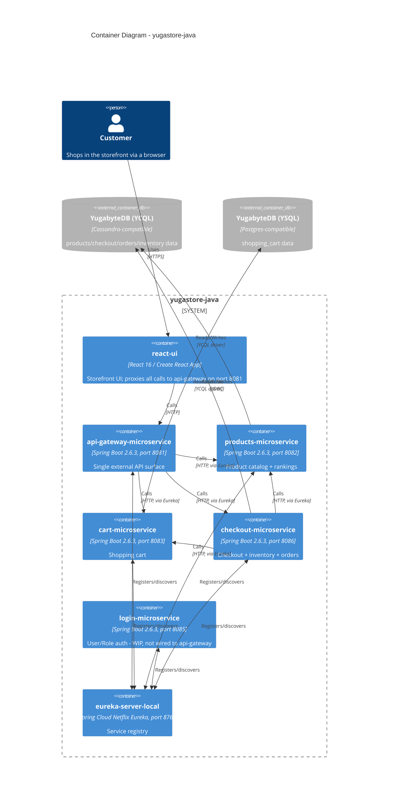
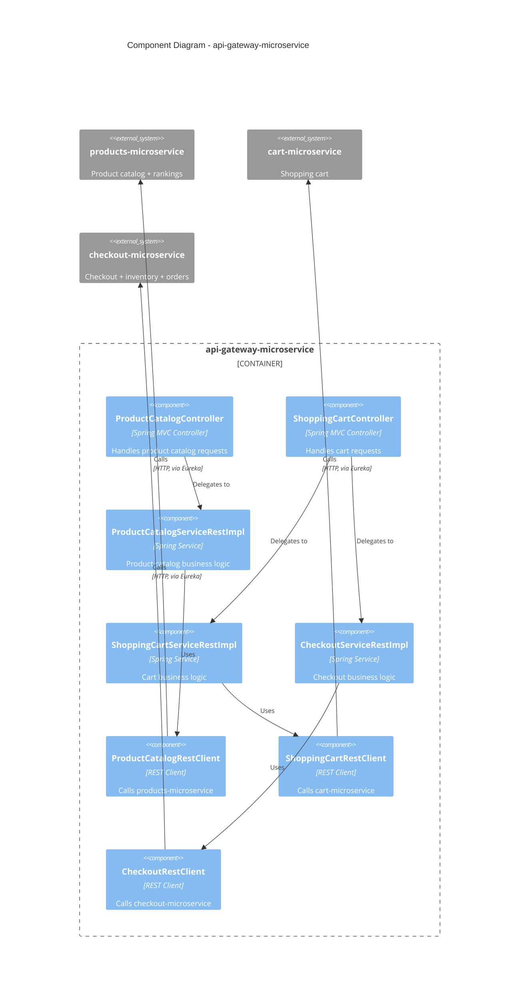

# Architecture Assessment: yugastore-java

Generated by `rabbit-architecture-assessment-rollup` from the 7 per-tier assessments below. This
rollup only reads those files and never performs its own 16-factor scoring (contract:
`specs/003-architecture-assessment/contracts/rabbit-architecture-assessment-rollup.md`).

**Assessed**: 2026-09-15

## Tier Assessments

- [`eureka-server-local`](./eureka-server-local.md)
- [`products-microservice`](./products-microservice.md)
- [`checkout-microservice`](./checkout-microservice.md)
- [`cart-microservice`](./cart-microservice.md)
- [`api-gateway-microservice`](./api-gateway-microservice.md)
- [`login-microservice`](./login-microservice.md)
- [`react-ui`](./react-ui.md)

## C1: System Context

## C2: Container

## C3: Component (`api-gateway-microservice` only)

No C4-Code (level 4) diagram is included, per this feature's scope.
